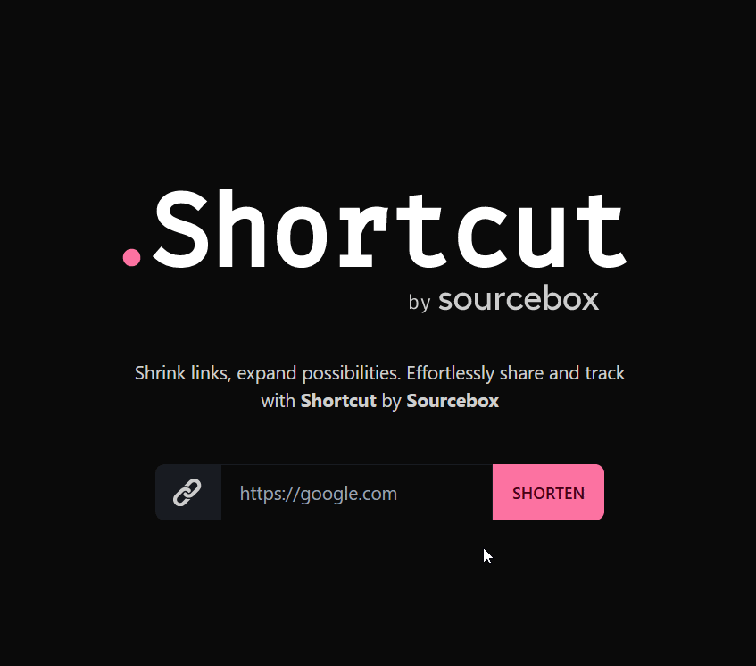

# Shortcut by Sourcebox



## Development

Install packages

```bash
npm install
```

Start the server

```bash
npm run dev
```

## Docker

Via docker run

```bash
docker run -d \
    --name sourcebox_shortcuts \
    -v ./data:/data \
    -p 3000:3000 \
    -e DATABASE_URL="file://data/db1.sqlite" \
    -e SHORT_URL_DOMAIN="srcbx.be" \
    -e ORIGIN="https://shortcode.sourcebox.be" \
    ghcr.io/sourcebox-be/shortcut:3.8
```

Via docker compose

```yaml
version: "3.8"

services:
  sourcebox_shortcuts:
    container_name: sourcebox_shortcuts
    image: ghcr.io/sourcebox-be/shortcut:master
    restart: unless-stopped
    volumes:
      - ./data:/data
    ports:
      - 3000:3000
    environment:
      DATABASE_URL: "file://data/db1.sqlite"
      SHORT_URL_DOMAIN: "srcbx.be"
      ORIGIN: "https://shortcode.sourcebox.be"
```
